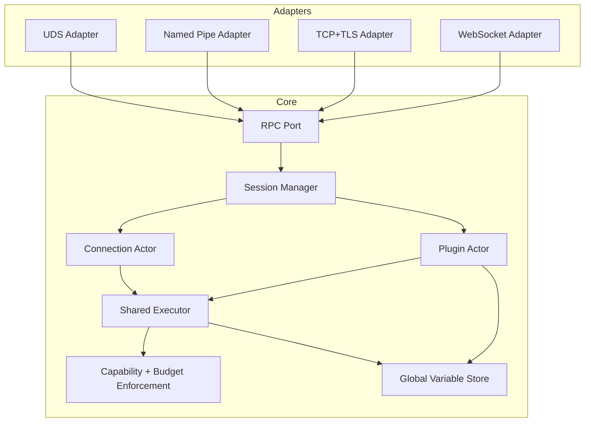
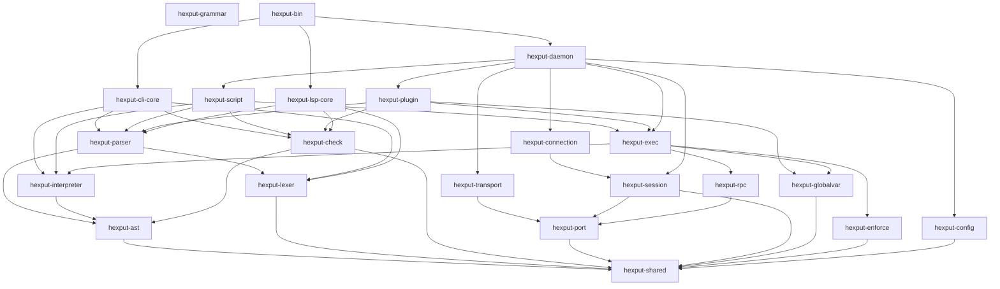
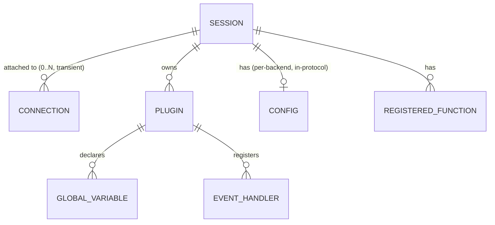

# Architecture Spine — Hexput v2

## Design Paradigm

**Hexagonal (Ports & Adapters)** at the transport boundary, wrapping an **Actor model** runtime core.

- `transport/*` — one adapter per Transport (UDS, Named Pipe, TCP+TLS, WebSocket), each implementing a single internal `Port` interface. No transport-specific behavior crosses into the core.
- `session/`, `connection/`, `plugin/` — the actor layer: a `Session` (durable, Client-ID-keyed) owns a transient `Connection` actor and zero or more `Plugin` actors. Ownership here is lifecycle ownership, not a per-operation consistency boundary: `Session` creates and tears down `Plugin`s (AD-4's `teardown` contract), but a `Plugin` — together with its Global Variable store — is its own consistency boundary for event dispatch, since `session/` never mediates a single Event invocation.
- `exec/`, `enforce/` — the shared execution core every actor's work funnels through; this is where Capability and Resource Budget rules apply, once, for every mode.

## Invariants & Rules



Dependency direction: Adapters depend on the Core `Port`; the Core never imports or branches on a specific Adapter. Nothing depends back on Adapters.

### AD-1 — Transport-agnostic core [ADOPTED]

- **Binds:** FR-9, FR-11, all Transports
- **Prevents:** transport-specific behavior leaking into session/execution semantics; adapters and core drifting on per-transport protocol behavior; health/metrics (FR-11) becoming a fifth, structurally separate listener
- **Rule:** every Transport is an adapter implementing one internal `Port` interface; the Core crate graph never imports or branches on a specific transport type — enforced by which crates list `hexput-transport` as a dependency (only `hexput-daemon` does). Health/metrics (FR-11) is served through that same `Port`, exempted from the init-handshake gate (FR-1) rather than given its own listener.

### AD-2 — Session outlives Connection, and may have several at once [ADOPTED]

- **Binds:** FR-1, FR-2, FR-3, FR-13, FR-21, FR-24
- **Prevents:** Plugin/Config/Registered-Function state being coupled to a single live socket, breaking reconnect (FR-2) and Plugin persistence (FR-21); a Session's connection cardinality being read differently by independently-built units
- **Rule:** `Session` is a distinct, owned entity keyed by Client ID, with a TTL sourced from System Config (AD-5). A Session may have zero or more concurrently attached `Connection` actors (FR-2) — never exactly one. Each `Connection` is attached to at most one `Session` at a time and holds no state that outlives it. Requests and their responses correlate to the specific `Connection` that issued them; there is no cross-Connection broadcast of results — Connections are isolated from each other even when they share a Session. The Session's TTL clock (FR-21, FR-24) only starts once the last attached Connection drops; while at least one Connection is attached, the Session is actively alive with no TTL countdown running. Session-owned state (Plugins, Config, Global Variables) is shared and consistent across every attached Connection. The reconnect credential (FR-13) is validated once, in `hexput-session`, before a reconnect request is accepted — every Transport adapter forwards the credential unchanged through the Port; no adapter performs its own validation, and no transport crate depends on `hexput-session` in a way that would let it try.

### AD-3 — One shared Executor enforces Capability + Resource Budget for every execution path, for its full duration [ADOPTED]

- **Binds:** FR-6, FR-7, FR-8, FR-19, FR-25
- **Prevents:** Direct Execution, Cached Execution, and Plugin Event handlers implementing capability/budget checks independently and drifting apart; async handler work (AD-6) silently escaping budget accounting once dispatch returns
- **Rule:** all three execution paths call into one `Executor` entry point; no path may reach a Registered Function or consume Resource Budget outside it. For any execution that continues past its dispatching call's return — every `async = true` Plugin handler (AD-6) — `Executor` hands the spawned task a live budget-accounting handle, not a closed one; every budget-relevant operation that task performs afterward, including Global Variable writes counted as side effects (AD-4), charges through that same handle. `hexput-globalvar` has no dependency on `hexput-enforce` or `hexput-rpc` at all — a second path into either is not merely discouraged, it does not compile. Global Variable access itself is intrinsic language state, not a Registered Function — exempt from FR-6/FR-7's capability-grant requirement, reached only through the direct `Executor`/`Plugin → GVStore` path (never through `rpc/`). Both of Plugin's dispatch paths (the priority sequencing task and directly-spawned `async` handlers, AD-4) invoke the same single handler-invocation function in `exec/` — capability checks, budget-handle setup, and Global Variable access all happen in that one shared function; the two paths differ only in *when* they're scheduled, never in *what* runs.

### AD-4 — Global Variable store is independent of the Plugin actor's mailbox [ADOPTED]

- **Binds:** FR-20, FR-22, FR-23, FR-25
- **Prevents:** `async` handlers (FR-23) being forced through a serialized mailbox (breaking their bypass-ordering requirement); `priority`-ordered handlers (FR-22) losing sequencing, or accidentally serializing *different* Events on the same Plugin; the store leaking on teardown; `keyed` variables (FR-25) serializing unrelated partitions
- **Rule:** a Plugin's Global Variables live in a shared concurrent per-Plugin store, independent of and reachable without the Plugin actor being alive. Locking is per-`(top-level-key, partition-key)` — for a non-`keyed` variable, partition-key is a constant, collapsing to plain per-top-level-key locking; for a `keyed` variable (FR-25), different Backend-supplied keys never contend for the same lock. A Global Variable's lock is never held across an `.await` point (e.g. a handler's mid-execution RPC call) — every read/write is a short, synchronous critical section against the store; a handler that needs the value across an await re-acquires it. The Backend-configurable "unsafe/lock-free" strategy (FR-20) is implemented entirely in safe Rust — no `unsafe` blocks — by using the store's finer-grained/optimistic access instead of the default per-key critical section; it trades logical race-safety (permits lost updates, stale reads) for latency, and is unrelated to the Security NFR's "no unsafe Rust in the parser/VM path" rule, which is about memory safety, not this concurrency-semantics choice. `hexput-globalvar` exposes `teardown(plugin_id)` as its sole store-lifecycle entry point; `hexput-session`'s TTL-expiry and explicit-unregister paths (AD-2, FR-21) are its only callers, invoked synchronously before the Plugin actor is dropped — teardown is never implied by actor `Drop`. The Plugin actor owns event routing and ordering *metadata* only (which handler runs at which priority) — it does not itself execute the ordered chain: `priority`-ordered dispatch for one Event is a per-(Plugin, Event) sequencing task spawned independently of the actor's mailbox, so an in-progress priority chain for one Event never blocks a different Event arriving concurrently for the same Plugin. Both that sequencing task and directly-spawned `async` handlers read/write the same Global Variable store.

### AD-5 — Per-backend Config and System Config are separate, non-overlapping surfaces [ADOPTED]

- **Binds:** FR-1, FR-3, FR-24
- **Prevents:** daemon operational settings (bind addresses, TLS paths, log level, Session TTL) being conflated with backend-supplied execution policy, or either surface silently absorbing the other's responsibility; a runtime Config update (FR-3) silently not reaching already-registered Plugins
- **Rule:** System Config (file-based) is the only source of the daemon's own operational settings. Per-backend Config never touches disk and never configures the daemon itself. `session/` holds the single mutable, live copy of a Session's per-backend Config; `plugin/`, `script/`, and `exec/` read through that copy on every dispatch — none of them snapshot or cache it at registration time — so an FR-3 runtime update is visible to Plugin Event dispatch exactly as it is to Direct/Cached Execution, with no separate propagation path to keep in sync.

### AD-6 — Non-blocking dispatch is structural, not incidental [ADOPTED]

- **Binds:** FR-16
- **Prevents:** a slow execution on one connection or Plugin stalling unrelated work — the head-of-line blocking FR-16 explicitly forbids
- **Rule:** every execution (Direct, Cached, Plugin handler) dispatches as an independent async task on the shared runtime. The only permitted serialization is a Plugin's own opted-in `priority` ordering (FR-22) among its own handlers for one Event — never across connections, Plugins, or Events (AD-4's per-(Plugin, Event) sequencing task is what makes this hold in practice).

### AD-7 — System Config discovery is one deployment-agnostic precedence, packaging doesn't change it [ADOPTED]

- **Binds:** FR-24
- **Prevents:** a systemd build and a Docker build independently inventing different config-discovery logic (different default paths, different override mechanisms) that silently diverge
- **Rule:** `config/` resolves the System Config file's location via one fixed precedence regardless of packaging — explicit CLI flag, then environment variable, then a fixed default OS path. systemd units and Docker images both just set the environment variable or bind-mount the default path; neither changes `config/`'s resolution logic.

### AD-8 — One check pass, one invocation point per submission path [ADOPTED]

- **Binds:** FR-26, FR-3, FR-5, FR-6
- **Prevents:** Direct submission, Cached registration, and Plugin registration each growing their own partial checker and disagreeing about what is a finding; the check drifting into a second, unenforced capability surface; the hot path paying for a check it already passed
- **Rule:** `check/` exposes a single pure entry point taking a parsed AST plus the callable-name set and the active policy, and returning findings — it never executes a script, never reaches `rpc/` or `enforce/`, and holds no state between calls. It is invoked from exactly one place per submission path: `script/` on Direct Execution and on `CodeRegister` (never again on `CachedExecutionStart` — a registered script is checked once, at registration), and `plugin/` at Plugin registration. The mode (`off`/`warn`/`error`) is read from the `session/` live Config on every submission, never snapshotted (AD-5). Findings reuse the error shape defined once in `port/` (Consistency Conventions), so the daemon response, the CLI, and the language server render them identically. The check is advisory by construction: it never grants, denies, or substitutes for a capability check or a budget charge — those remain `enforce/`'s alone, reached only through the `Executor` (AD-3), and a script passing the check is not thereby authorized for anything.

## Consistency Conventions

| Concern | Convention |
| --- | --- |
| Naming (entities, files, interfaces, events) | Code identifiers match PRD §3 Glossary terms verbatim (`Session`, `Plugin`, `GlobalVariable`, `Capability`, ...) — no synonyms |
| Data & formats (ids, dates, error shapes, envelopes) | MessagePack (`rmp-serde`/`serde`) wire envelope for all Transports; Client ID and error shapes defined once in `port/`, reused by every adapter |
| State & cross-cutting (mutation, errors, logging, config, auth) | All state mutation with security/budget consequences flows through `exec`/`enforce` (AD-3); structured logging via `tracing`, every entry tagged with Client ID (PRD FR-12); config split per AD-5 |
| Locking discipline | No lock (Global Variable or otherwise) is ever held across an `.await` point — critical sections stay short and synchronous; re-acquire after suspension instead |

## Stack

| Name | Version |
| --- | --- |
| Rust | 1.98.1 (2024 edition) |
| tokio | 1.53.1 |
| tokio-tungstenite | 0.30.0 |
| rustls | 0.23.45 |
| serde | 1.0.229 |
| rmp-serde | 1.3.1 |
| dashmap | 6.2.1 |
| moka | 0.12.16 |
| criterion | 0.8.2 |
| tracing | 0.1.44 |

## Structural Seed

**[Amended 2026-09-18, post-final, per user direction: "her modülü kendi crate'ine ayıralım... shared crate'in iç modül yapısı da olabildiğince parçalı olmalı... bütün crateler lib olmalı, binarylerin çıkacağı bin diye ayrı bir crate olmalı."]** What was one crate with an internal module tree is now a Cargo workspace: one crate per Structural Seed module, plus crates for the language (never named as a module above because it sits underneath `script/`, `check/`, and `plugin/` rather than being one itself) and for developer tooling. This is not cosmetic — a crate boundary is a dependency edge Cargo enforces at compile time, where a module boundary was only convention. Several ADs below (AD-1, AD-3, AD-4, AD-5, AD-8) state a rule of the shape "only X may reach Y directly" — under the module tree that rule lived in code review; under the crate graph, the crate that must not reach Y simply does not list it as a dependency, and doing so anyway is a compile error, not a review finding.

**Every crate is a `lib` crate.** Exactly one crate in the workspace, `hexput-bin`, is allowed to produce a binary; every other crate — including `hexput-daemon` — exposes a `run()`-shaped entry point and nothing calls `std::process::exit` or owns a `fn main()`. `hexput-bin` itself stays systematically thin: one file per binary under `src/bin/`, each doing nothing but argument parsing hand-off and a call into the one library crate that actually implements that binary. No logic lives in `hexput-bin` that isn't about being an operating-system entry point.

```text
Cargo.toml                    # [workspace], members below, pinned deps hoisted to [workspace.dependencies]
crates/
  hexput-shared/               # cross-cutting types every other crate may depend on; internally split, never a grab-bag
    src/
      diagnostics.rs           # Category, Code, Diagnostic, Span — the one error/finding shape (§7 LANGUAGE-REFERENCE, port/ errors)
      wire.rs                  # MessagePack envelope, correlation id, message-type enum (Consistency Conventions)
      ids.rs                   # ClientId, SessionId, PluginId — newtypes, never bare strings/uuids past the boundary
      budget.rs                # the six Resource Budget dimensions (FR-8) as one enum, shared by enforce/check/metrics
      lib.rs

  # — language: no execution, no I/O, no host access —
  hexput-ast/                  # AST node types + Span — data only, no lexing/parsing/eval logic
  hexput-lexer/                # tokenizer (Epic 1 Story 1.2) — depends on hexput-shared only
  hexput-parser/                # parser (Stories 1.3-1.5) — depends on hexput-lexer, hexput-ast
  hexput-interpreter/          # tree-walking evaluator (Stories 1.6-1.7) — depends on hexput-ast only, no host reach
  hexput-check/                # static check (FR-26, AD-8) — depends on hexput-ast only; NOT hexput-interpreter, NOT hexput-rpc, NOT hexput-enforce, by construction
  hexput-cli-core/             # eval + check command logic (Stories 1.9-1.10) — depends on lexer/parser/interpreter/check

  # — daemon: one crate per Structural Seed module —
  hexput-transport/            # adapters: uds.rs, named_pipe.rs, tcp_tls.rs, websocket.rs — one Port impl each
  hexput-port/                  # wire envelope + request/response + event correlation, built on hexput-shared::wire
  hexput-session/                # Client ID -> Session, TTL (from System Config), reconnect + FR-13 protection
  hexput-connection/            # transient per-connection actor, attached to a Session
  hexput-script/                # Direct/Cached Execution: AST cache (moka), parse/interpret entry points
  hexput-plugin/                # Plugin actor: registration, event routing, priority/async dispatch (AD-4)
  hexput-globalvar/              # Global Variable store: per-Plugin concurrent map (dashmap), locking + behavior strategies
  hexput-exec/                   # the one shared Executor all three modes funnel through (AD-3) — the only crate depending on hexput-enforce
  hexput-enforce/                # Capability checks + Resource Budget enforcement — reachable only via hexput-exec
  hexput-rpc/                    # host-function registry, capability grants, outbound RPC dispatch to Backend
  hexput-config/                 # System Config (file) parsing — separate crate from hexput-session's per-backend Config
  hexput-daemon/                  # wiring root: composes every daemon crate above into one runnable `run(SystemConfig)`

  # — developer tooling (FR-14, FR-15), independent of the daemon —
  hexput-grammar/               # tree-sitter grammar
  hexput-lsp-core/               # language server logic — depends on lexer/parser/check only, never interpreter or any daemon crate

  hexput-bin/                    # the ONLY crate that produces binaries
    src/bin/
      hexput-daemon.rs          # thin main() -> hexput_daemon::run()
      hexput.rs                 # thin main() -> hexput_cli_core::run() (eval + check)
      hexput-lsp.rs              # thin main() -> hexput_lsp_core::run_server()
```

### Crate dependency graph

Direction matters more than the list — an edge only appears if the AD it enforces requires it. Nothing not listed is permitted.



What this graph makes a compile error rather than a review comment:

- **AD-1:** only `hexput-daemon` depends on `hexput-transport`. `hexput-session`, `hexput-script`, and `hexput-plugin` do not — so none of them can branch on a transport type even by accident.
- **AD-3:** `hexput-enforce` has exactly one dependent, `hexput-exec`. `hexput-rpc`, `hexput-plugin`, and `hexput-script` cannot reach it directly; a capability or budget check literally has to go through `hexput-exec`.
- **AD-4:** `hexput-globalvar` depends on neither `hexput-plugin` (the actor) nor `hexput-rpc` — the store is reachable with the actor dead, and never reachable through RPC, because those import edges don't exist.
- **AD-5:** `hexput-config` (System Config) and `hexput-session` (per-backend Config) are separate crates with no dependency between them — the two surfaces cannot accidentally merge into one type.
- **AD-8:** `hexput-check` depends on `hexput-ast` alone — not `hexput-interpreter`, not `hexput-rpc`, not `hexput-enforce`. It cannot execute a script or touch the host even by mistake; the capability to do so was never compiled in.

`[workspace.dependencies]` in the root `Cargo.toml` pins every version from the Stack table above exactly once; member crates inherit with `workspace = true` rather than re-pinning.



## Capability → Architecture Map

| Capability / Area | Lives in (crate) | Governed by |
| --- | --- | --- |
| Connection & Session lifecycle (FR-1, FR-2, FR-3, FR-13, FR-21, FR-24) | `hexput-session`, `hexput-connection`, `hexput-config` | AD-2, AD-5 |
| Script execution (FR-4, FR-5, FR-16) | `hexput-script`, `hexput-exec` | AD-3, AD-6 |
| Static check (FR-26) | `hexput-check`, invoked from `hexput-script` and `hexput-plugin` | AD-8 |
| Capability-based RPC (FR-6, FR-7) | `hexput-rpc`, `hexput-enforce` | AD-3 |
| Resource Budgeting (FR-8) | `hexput-enforce` | AD-3 |
| Transport layer (FR-9) | `hexput-transport`, `hexput-port` | AD-1 |
| Plugin Registration & Events (FR-17…FR-23, FR-25) | `hexput-plugin`, `hexput-globalvar`, `hexput-exec` | AD-3, AD-4, AD-6 |
| Health/metrics (FR-11) | `hexput-port` | AD-1 |
| Structured logging (FR-12) | cross-cutting via `tracing`, no dedicated crate | Consistency Conventions |
| Hexput language (Epic 1, feeds FR-4/5/14/15/19/26) | `hexput-ast`, `hexput-lexer`, `hexput-parser`, `hexput-interpreter` | none — pre-dates any FR, consumed by the rows above |

## Deferred

- Exact wire message schema/field layout inside `port/` — implementation detail once `rmp-serde`/`serde` types exist; not an invariant two independently-built units would diverge on given AD-1.
- TLS certificate reload mechanism (hot-reload vs. restart-required) — operational detail, not structural.
- Priority tie-breaking convention, default handler order absent `priority`, and `async`+`priority` combination precedence — already flagged as [ASSUMPTION]s in PRD OQ-11; low risk, revisit before `plugin/` ordering logic is implemented.
- Master-slave horizontal scaling — explicitly future work (PRD §6.2, brief Scope) — no AD here; `session/` and `plugin/` ownership models above are designed to not preclude it, not to implement it.
- OS-level sandboxing (seccomp/cgroups/namespaces) — permanently out per PRD/brief; not part of this spine's trust model.
- Tree-sitter grammar / LSP (FR-14, FR-15) — `hexput-grammar` and `hexput-lsp-core`, separate deliverables/tools, not part of the daemon's own crate graph; no AD here. `hexput-lsp-core` depends on `hexput-check` (AD-8) as a library for its diagnostics, which is why that crate is pure and has no dependency on `hexput-daemon` or any crate that does.
- Client SDKs (FR-10) — external, per-language libraries that speak the `port/` wire protocol; not part of the daemon's own architecture, so out of this spine entirely, not merely unmentioned.
- Benchmark harness structure (PRD SM-1, brief addendum) — thesis-deliverable detail, not a system invariant.
- Exact `keyed` Global Variable storage layout (e.g. nested map keyed by Backend-supplied key) — implementation detail within `globalvar/`, owned by the code once it exists.
- Deployment & environments: systemd-unit vs. Docker-image as the packaging artifact (or both), environment/config profiles (dev/staging/prod), process-supervision and restart policy, upgrade/rollback story. System Config *discovery* is structural and covered by AD-7; everything else here is packaging-time and doesn't change `config/`'s logic or any other module's structure, so no further AD is needed — this is a deliberate defer, not a silent gap.
